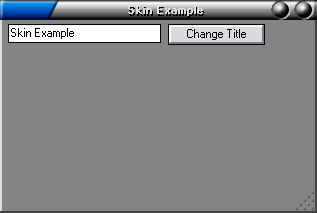



## Apply a Skin To a Form

### Description

Example of how to apply a complex looking skin to any form. Please vote.
 
### More Info
 

             |
---                |---
**Submitted On**   |2003-11-11 19:40:18
**By**             |[KRYO\_11](https://github.com/Planet-Source-Code/PSCIndex/blob/master/ByAuthor/kryo-11.md)
**Level**          |Advanced
**User Rating**    |4.5 (36 globes from 8 users)
**Compatibility**  |VB 5\.0, VB 6\.0
**Category**       |[Graphics](https://github.com/Planet-Source-Code/PSCIndex/blob/master/ByCategory/graphics__1-46.md)
**World**          |[Visual Basic](https://github.com/Planet-Source-Code/PSCIndex/blob/master/ByWorld/visual-basic.md)
**Archive File**   |[Apply\_a\_Sk16709211112003\.zip](https://github.com/Planet-Source-Code/kryo-11-apply-a-skin-to-a-form__1-49840/archive/master.zip)

